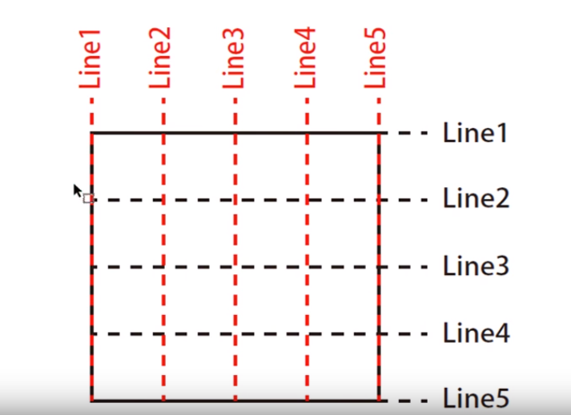
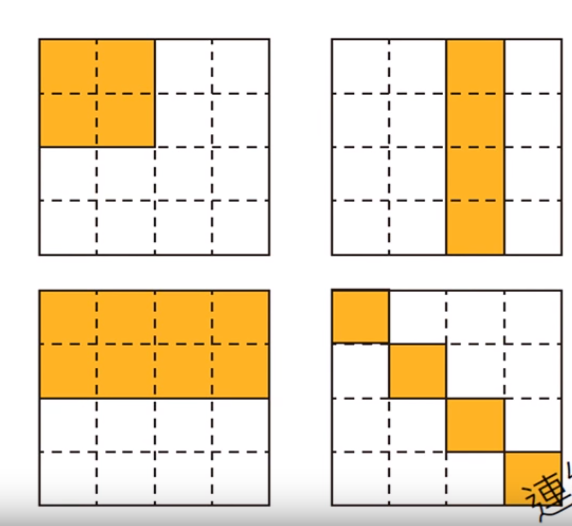
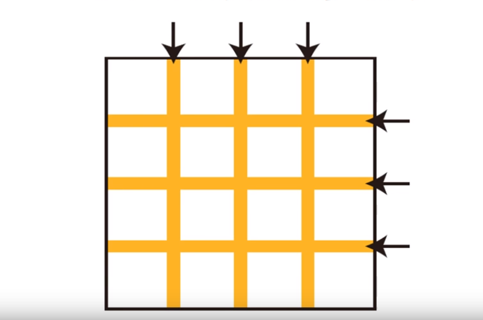
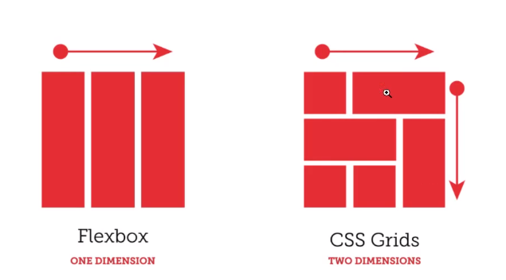
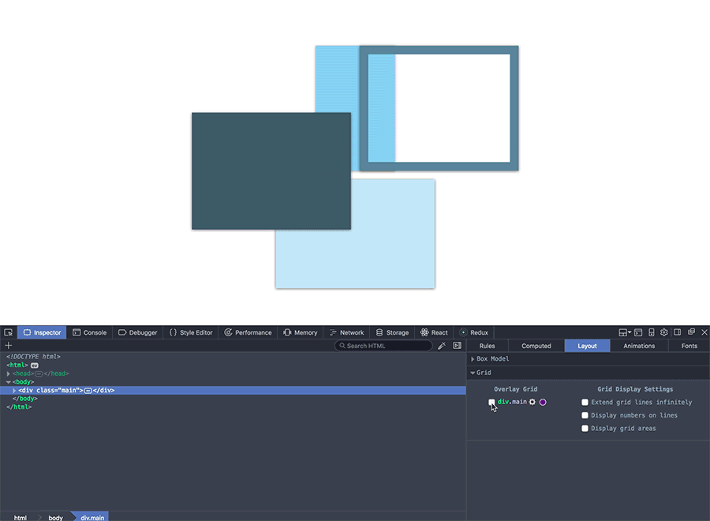

#                                                       

#                                                       

#                                                       Study-summarize


# Questions && Solution


#  Gain

## # 玩转Grid布局     

.png)

### Grid简介：

  Grid Layout是CSS中最强大的布局系统。和[flexbox](https://css-tricks.com/snippets/css/a-guide-to-flexbox/)一维布局系统不同的是，它是一个二维系统，这就意味着它可以同时处理列和行。通过将CSS规则应用于父元素（成为网格容器container）和子元素（成为网格项item），你就可以使用Grid网格布局了。 

### Grid简单了解：

简单来说，我们可以把Grid看成是一张画布，更准确来讲是可以看成一堆格子。可以说Grid布局真的超级好用，就像是前端的毒品一样，用了就停不下来了 0-<

- **线的概念**



- **面的概念**  




- **还能快速设定间距**  



### 常用CSS布局方式：

- 双飞翼布局
- 圣杯布局
- 文档流布局
- 浮动布局
- 定位布局
- flex布局

### 与Flex布局对比：

- 共同点：元素都是放在一个父级容器（container）之中，子元素（item）尺寸，位置受容器影响。

- 区别：   Flex属于一维单坐标布局，而Grid属于二维布局，元素可以在两个维度进行排列。

 

### 调试工具：

目前最好的Grid布局调试工具应该是[Firefox Nightly](https://link.juejin.im/?target=https%3A%2F%2Fwww.mozilla.org%2Fen-US%2Ffirefox%2Fchannel%2Fdesktop%2F)中的这个网格调试的辅助工具，可以显示网格线、间隔与网格单元  



参考： 

- https://css-tricks.com/difference-explicit-implicit-grids/  
- https://css-tricks.com/snippets/css/complete-guide-grid/  
- https://juejin.im/entry/59a586846fb9a0248a400269  
- https://www.jianshu.com/p/d183265a8dad

# Deep  Thinking


# Special  Tricks

1. :before和:after惊人用法

      在这里展示一个常用的场景，很多人写过如下清除浮动的代码：

```css
<div id="container">
    <div class="content-left">this is left content.</div>
    <div class="content-right">this is right content.</div>
    <div class="clear"></div>
</div>

对应的css代码如下：
.content-left{
    float: left;
    width: 150px;
    font-weight:bold;
}
.content-right{
    float: right;
    width: 450px;
    font-weight:bold;
}
.clear{
    clear: both;
}

为了清除上面的浮动，多添加了一个<div>元素，并给此<div>元素添加了clear样式，这种做法破坏了HTML5的语义化原则，因此应对css样式进行修改，添加如下代码：
 .clearfix{
      zoom: 1;
  }
  .clearfix:before,
  .clearfix:after{
      display: table;
      content: "";
  }
.clearfix:after{
    clear: both;
 }
只要在父容器上应用clearfix这个类即可实现清除浮动。。。
```